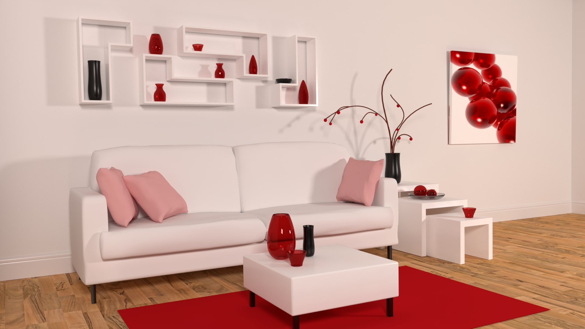
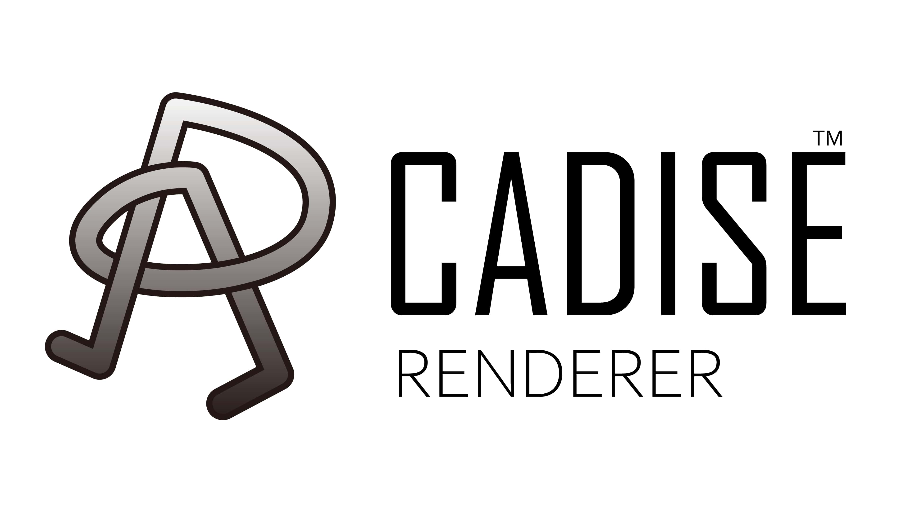
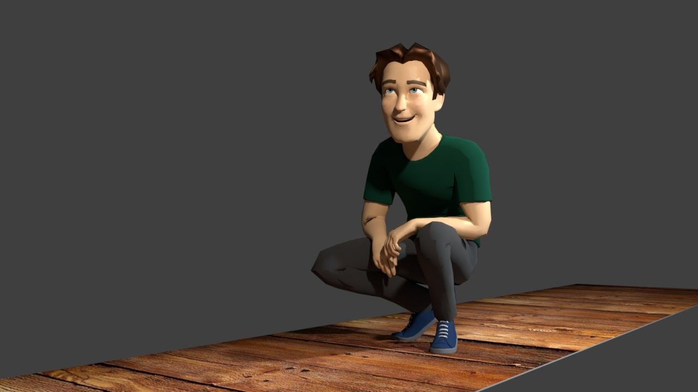
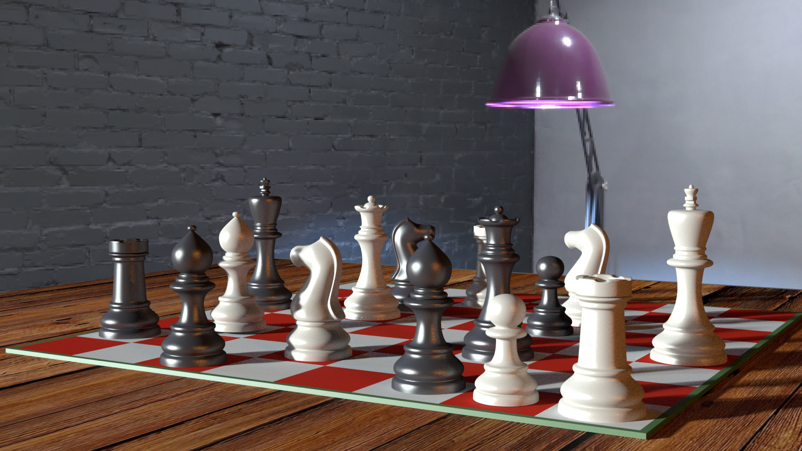
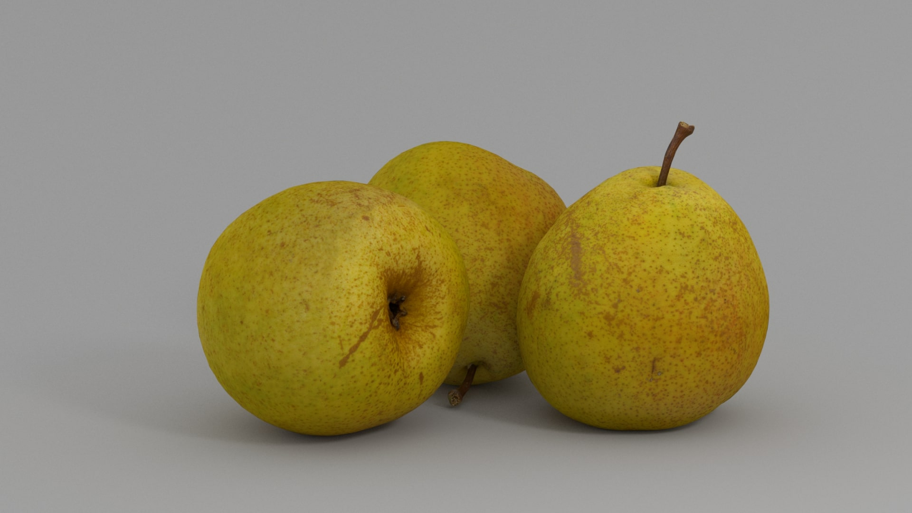
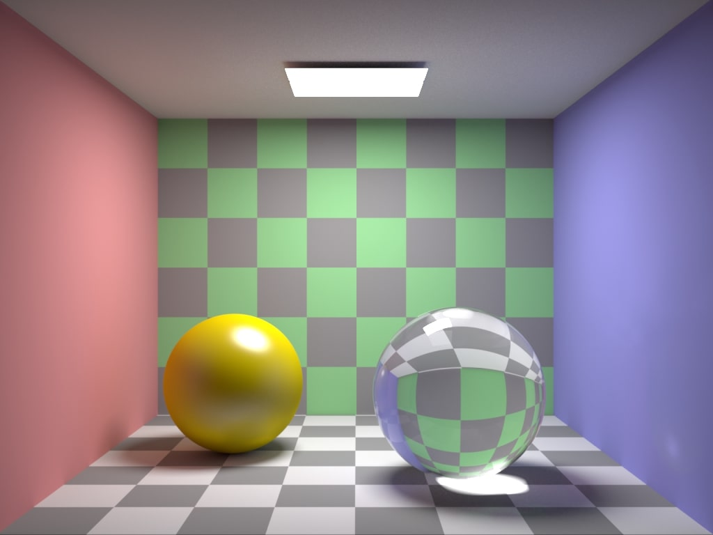

# Cadise Renderer

<i>Living Room Scene Rendered with Cadise (based on <a href="https://www.blendswap.com/blend/13491">The Modern Living Room</a> scene by Wig42)</i>

## Introduction
Cadise is a physically based renderer written in C++17, taking some other renderers ([PBRT-v3](https://github.com/mmp/pbrt-v3), [Photon-v2](https://github.com/TzuChieh/Photon-v2), [Tungsten](https://github.com/tunabrain/tungsten), etc) as references. The main purpose of a renderer is to solve the integral problem described in [rendering equation](https://en.wikipedia.org/wiki/Rendering_equation), which is more often known as light transport simulation.

Cadise is still been developing and more features will be implemented.
(an overview of features is in the `FEATURE.md`)

| Master branch | Develop branch |
|     :---:     |      :---:     |
| |  |

## Scene Description
Cadise Renderer Scene Description (CRSD) developed by Chia-Yu Chou is a scene description and readable by Cadise renderer. To generate a CRSD file, you can find some example scenes in the `./scene/` folder for reference, or export scenes from other 3D softwares (it currently only supports Blender exporter, please see the following repository for further information).

- [**Cadise for Blender**](https://github.com/xh5a5n6k6/cadise-blender)

## License
Cadise is under the [MIT](https://opensource.org/licenses/MIT) license. 

It also includes some third-party libraries in the `./source/third-party/` folder with their own licenses, you can see the `LICENSE.txt` for more details.

The Logo of Cadise Renderer

## Gallery
Here are some images rendered with Cadise.

The above image is NOT used for any commercial purposes.

<i>Anger Scene (based on <a href="https://www.blendswap.com/blend/16288">Anger (Furia)</a> scene by hfmm99)</i>

<i>iPhone Scene (based on <a href="https://www.blendswap.com/blend/18439">iPhone 7 Plus</a> scene by sriniwasjha)</i>

<i>Mike Scene (based on <a href="https://www.blendswap.com/blend/22596">Mike Rig</a> scene by lucky3d1)</i>

<i>Chess Scene (based on <a href="https://www.blendswap.com/blend/18589">Standard Chess Set</a> scene by MiriamAHoyt; HDRI is <a href="https://hdrihaven.com/hdri/?c=artificial%20light&h=colorful_studio">Colorful Studio</a> by Sergej Majboroda)</i>

<i>Pear Scene (based on <a href="https://www.blendswap.com/blend/18747">Pear</a> scene by MZiemys)</i>

<i>Snowman Scene (based on <a href="https://www.blendswap.com/blend/22629">Lowpoly Snowman</a> scene by sumo12)</i>

<i>Cornell Box Scene (based on original <a href="https://www.graphics.cornell.edu/online/box/data.html">Cornell Box Data</a>)</i>
