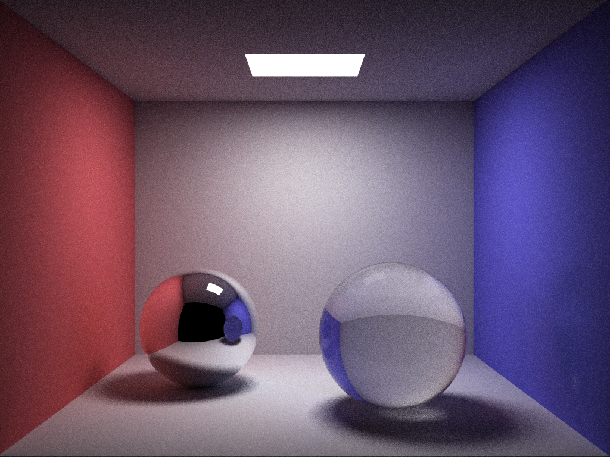

# Cadise Renderer

 

<i>Cornell Box (mirror and glass spheres) Rendered with Cadise</i>

## Introduction
Cadise is a developing ray tracing renderer written in C++17, taking some renderers ([PBRT-v3](https://github.com/mmp/pbrt-v3), [Photon-v2](https://github.com/TzuChieh/Photon-v2), [Tungsten](https://github.com/tunabrain/tungsten), etc) as references. It now only support some basic features as the cover image shows, and it still has a long way to go.

## Feature Lists
- ### Renderer
    - Whitted Ray Tracing
- ### Accelerator
    - BVH
- ### BSDF
    - Lambertian Diffuse
    - Specular Reflection
    - Specular Transmission
    - Perfect Dielectric
- ### Primitive
    - Sphere
    - Triangle
    - Rectangle
- ### Light
    - Point Light
    - Area Light (rectangle)

## License
Cadise is under the <a href="https://opensource.org/licenses/MIT">MIT</a> license. 

It also includes some third-party libraries in the `./source/third-party` folder with their own licenses, you can see the `LICENSE.txt` for more details.