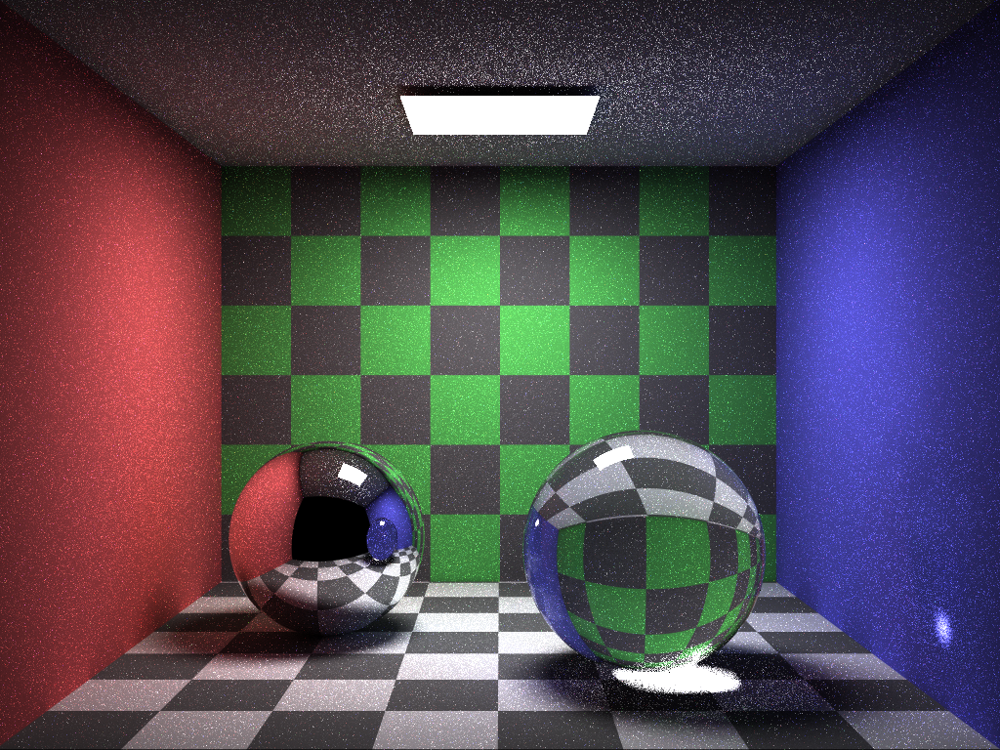

# Cadise Renderer

 

<i>Cornell Box (with spheres) Rendered with Cadise</i>

## Introduction
Cadise is a physically based renderer written in C++17, taking some other renderers ([PBRT-v3](https://github.com/mmp/pbrt-v3), [Photon-v2](https://github.com/TzuChieh/Photon-v2), [Tungsten](https://github.com/tunabrain/tungsten), etc) as references. The main purpose of a renderer is to solve the integral problem described in [rendering equation](https://en.wikipedia.org/wiki/Rendering_equation), which is more often known as light transport simulation.

Cadise is still been developing and more features are expected to come.

## Feature Lists
- ### Rendering Technique
    - Whitted Ray Tracing
    - Unidirectional Path Tracing
    - Unidirectional Path Tracing with Next Event Estimation
- ### Accelerator
    - BVH
- ### BSDF
    - Lambertian Diffuse
    - Specular Reflection
    - Specular Transmission
    - Perfect Dielectric
- ### Primitive
    - Sphere
    - Triangle
    - Rectangle
- ### Light
    - Point Light
    - Area Light (rectangle)
- ### Texture
    - Constant
    - Checkerboard

## License
Cadise is under the <a href="https://opensource.org/licenses/MIT">MIT</a> license. 

It also includes some third-party libraries in the `./source/third-party` folder with their own licenses, you can see the `LICENSE.txt` for more details.